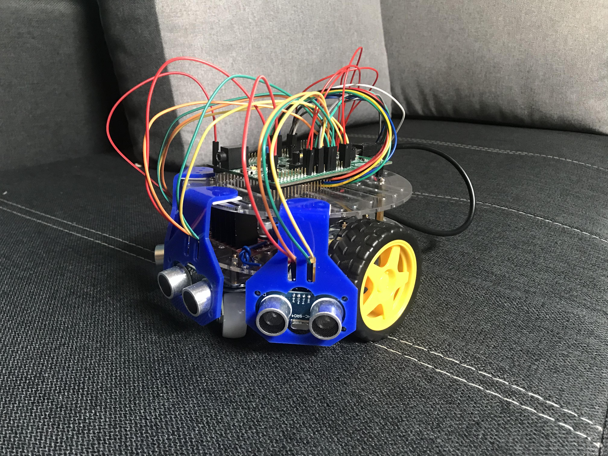

<p align="center">
  <a>
    
  </a>
</p>             

<!-- TABLE OF CONTENTS -->
## Table of Contents

* [About the Project](#about-the-project)
  * [Built With](#built-with)
* [Getting Started](#getting-started)
  * [Prerequisites](#prerequisites)
  * [Installation](#installation)
* [Contact](#contact)

<!-- ABOUT THE PROJECT -->
## About The Project
<p align="center">
  <a>
    
  </a>
</p>

F10 is a unviersity project where main goal is to use microcontroller STM32 in practical way. We decided to created remote controlled vehicle with 2 driving modes:
* Autonomous - 3 sonic sensors mounted in front of the vehicle are responsible for checking distance to obstacles. Basing on results vehicle is avoiding them, in some cases it can decide than obstacle can not be avoided in simple way and it stops.
* Manual -  is connected to PC app via WiFi. User can steer with vehicle by sending signals to it. Connection is provided by ESP8266 with TCP Protocol.

<p align="center">
  <a>
    
  </a>
</p>

### Built With
To run project you will need following modules:
* [Zephyr](https://www.zephyrproject.org)
* [CMake](https://cmake.org/)
* [Python](https://www.python.org/)

<!-- GETTING STARTED -->
## Getting Started

This is an example of how you may give instructions on setting up your project locally.
To get a local copy up and running follow these simple example steps.

### Prerequisites

1. Install Python. 
	1.1. For Windows download the newest version from [here](https://www.python.org/downloads/).
	1.2. For Linux (Ubuntu)  a add the deadsnakes PPA to your system’s sources list
	```
	$ sudo add-apt-repository ppa:deadsnakes/ppa
	```
	Once the repository is enabled, install Python 3.8 with:
	```
	$ sudo apt install python3.8
	```

### Installation

1. Install Zephyr Poject RTOS by following [this](https://docs.zephyrproject.org/latest/getting_started/index.html) instruction.
2. Clone the repo to any folder
	```
	git clone https://github.com/PUT-PTM-2020/P37/
	```
3. Copy zephyrproject from your local zephyr path to previously cloned folder but do not overwrite existing files.


## Authors

Robert Szczepański - [SomeLogic](https://github.com/SomeLogic)

Mateusz Sierszulski - [mts-srs](https://github.com/mts-srs)

Wojciech Rzeczycki - [VoiTee](https://github.com/VoiTee)

